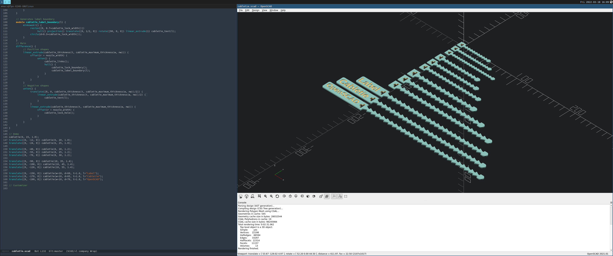
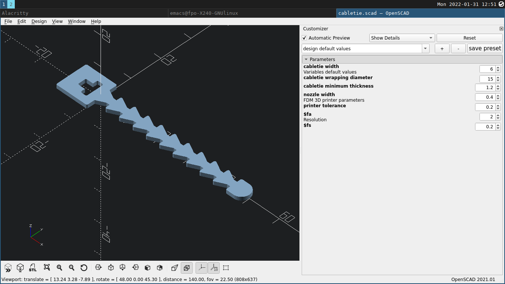

# Identification cable ties generator

The file [cabletie.scad](cabletie.scad) can be used as an OpenSCAD library to generate labelled cable ties of different sizes.

Once tight, the cable tie get locked. It can be released by a slight hand pressure.

## Usage

The module `cabletie()` takes up to 6 parameters:

1. cabletie_width (w) = [numerical];
2. cabletie_wrapping_diameter (d) = [numerical];
3. cabletie_minimum_thickness (t) = [numerical]; // would be override if too large
4. label (l) [string]
5. nozzle_width (nw) = [numerical];
6. printer_tolerance (pt) = [numerical];

## Demo

```scad
// Demo
cabletie(6, 15, 1.0);
translate([0, -12, 0]) cabletie(6, 20, 1.0);
translate([0, -24, 0]) cabletie(6, 25, 1.0);

translate([0, -40, 0]) cabletie(8, 20, 1.2);
translate([0, -55, 0]) cabletie(8, 25, 1.2);
translate([0, -70, 0]) cabletie(8, 30, 1.2);

translate([0, -90, 0]) cabletie(10, 35, 1.4);
translate([0, -108, 0]) cabletie(10, 45, 1.4);
translate([0, -126, 0]) cabletie(10, 55, 1.4);

translate([0, -150, 0]) cabletie(w=10, d=60, t=1.6, l="Label");
translate([0, -170, 0]) cabletie(w=10, d=65, t=1.6, l="Cabletie");
translate([0, -190, 0]) cabletie(w=10, d=70, t=1.6, l="OpenSCAD");
```



## Customizer

You may also use the OpenSCAD customizer utility to conveniently chenge the parameters:



## Photographies

### Cable ties without labels


### Cable ties with labels


