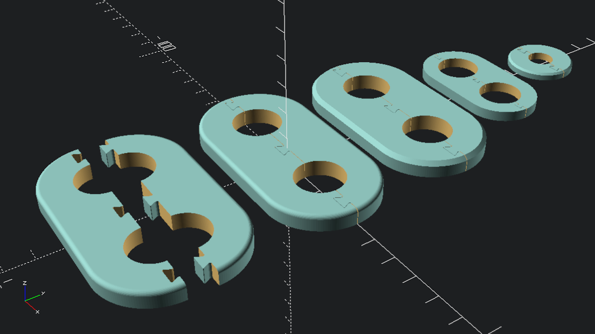
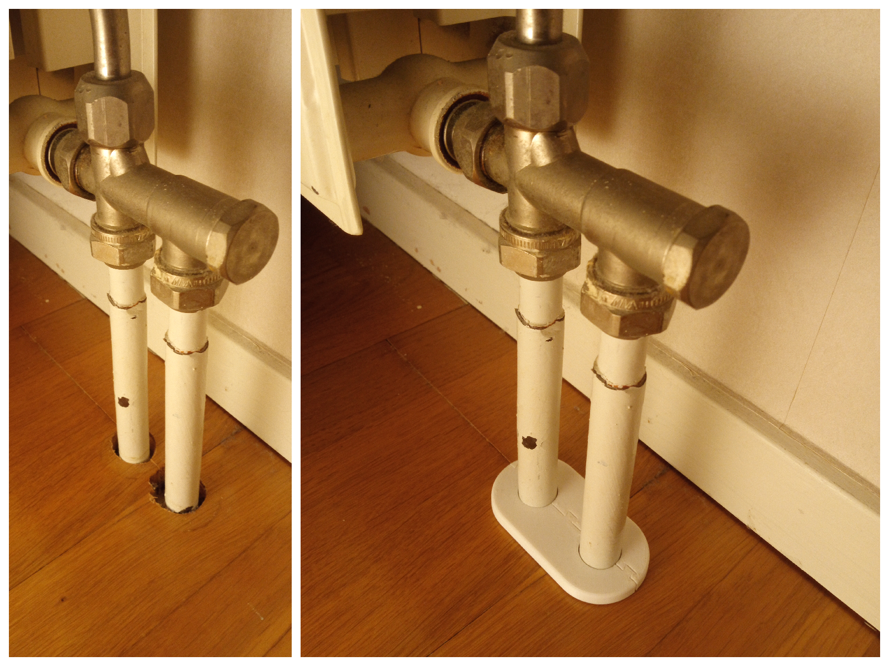

# Parametric escutcheon generator

The file [escutcheon.scad](escutcheon.scad) can be used as an [OpenSCAD](http://www.openscad.org/) library to generate single pipe or double pipes escutcheon. This model has been designed to be printed with ease in FDM printers. 

## Usage

The module `escutcheon()` takes up to 7 parameters:

1. escutcheon_height (h) = [numerical]
2. escutcheon_width (w) = [numerical]
3. escutcheon_hole_diameter (d) = [numerical]
4. separation_between_pipes (s) = [numerical]
5. edge (e) = [string with one of the following values: "chamfer", "filet" or "none"]
6. nozzle_width (nw) = [numerical]
7. printer_tolerance (pt) = [numerical]


## Demo

```scad
escutcheon();
translate([0, 50, 0]) escutcheon(s=36, e="chamfer");
translate([0, 90, 0]) escutcheon(h=4, w=6, d=16, s=24, e="none", nw=0.2, pt=0.2);
translate([0, 125, 0]) escutcheon(h=3, w=8, d=10, s=0, e="chamfer", nw=0.6, pt=0.3);
```



## Picture

