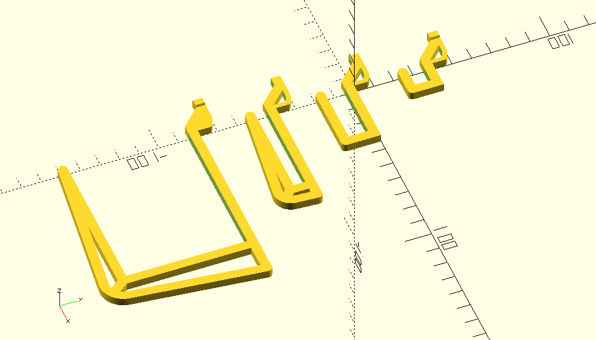
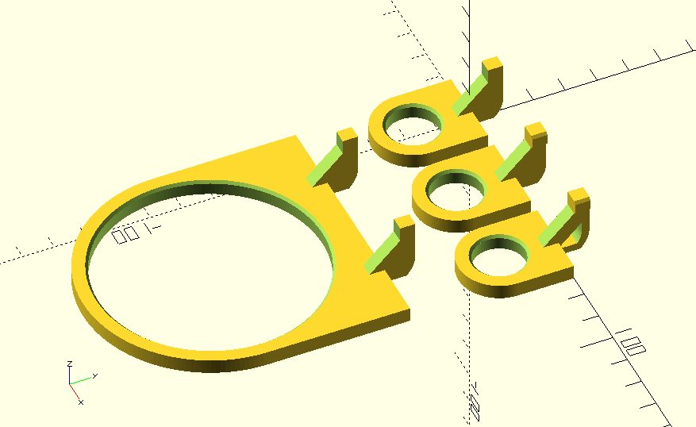
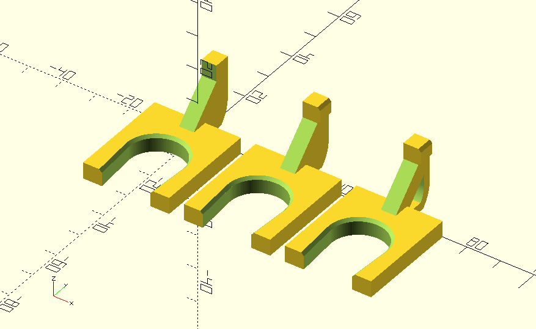
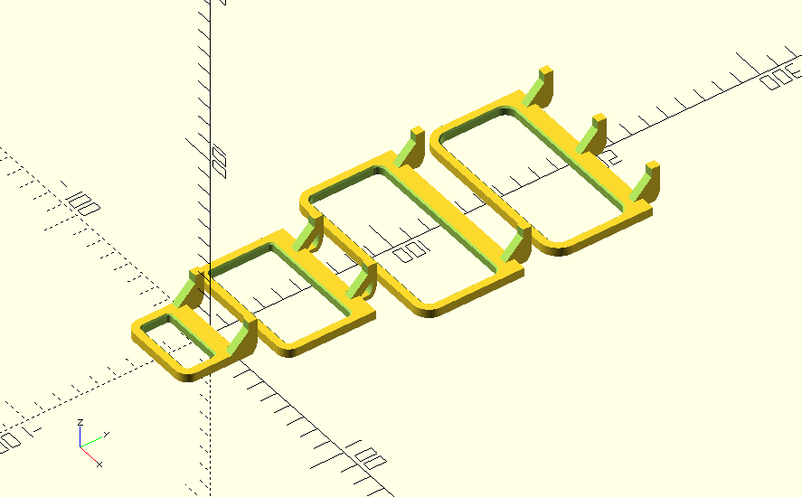
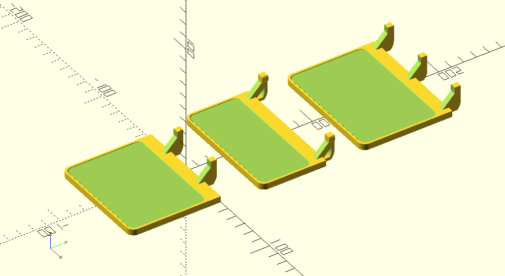
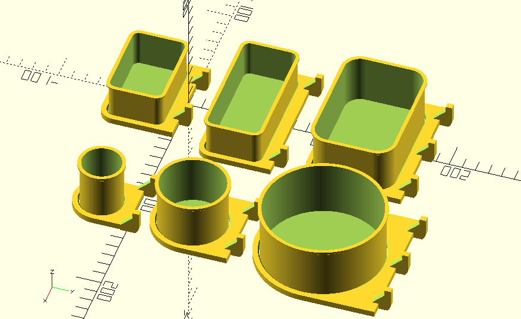
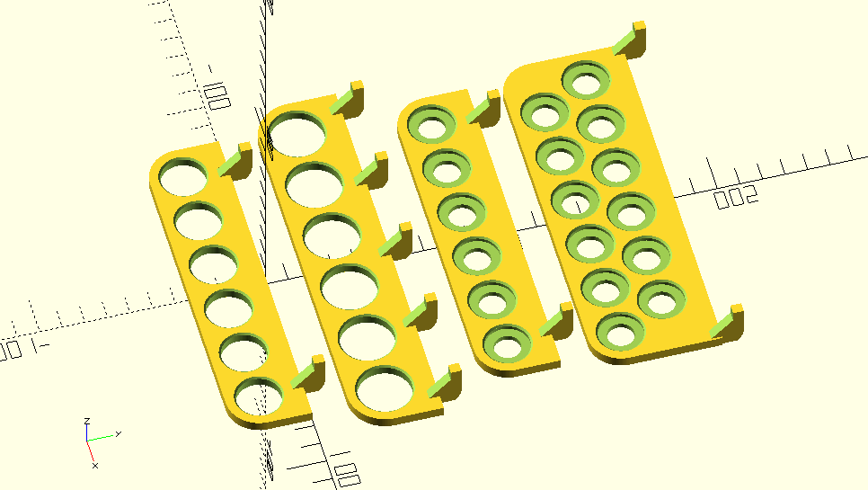
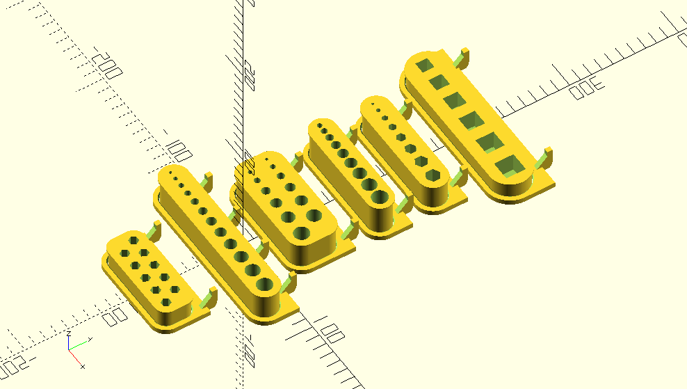

# Parametric Ikea Skådis Pegboard Accessories

The file [ikea_skadis.scad](ikea_skadis.scad) can be used as an [OpenSCAD](http://www.openscad.org/) library to generate accessories for the [IKEA Skådis pegboards](https://www.ikea.com/se/sv/search/products/?q=sk%C3%A5dis). These accessories are designed to be 3D printed with ease on [fused filament printers](https://en.wikipedia.org/wiki/Fused_filament_fabrication#Fused_deposition_modeling).

## Table of contents
- [Library usage](#library-usage)
- [Pegboard accessories modules](#pegboard-accessories-modules)
	- [Module skadis_curved_hook()](#module-skadis_curved_hook)
	- [Module skadis_squared_hook()](#module-skadis_squared_hook)
	- [Module skadis_straight_hook()](#module-skadis_straight_hook)
	- [Module skadis_o_holder()](#module-skadis_o_holder)
	- [Module skadis_u_holder()](#module-skadis_u_holder)
	- [Module skadis_squared_holder()](#module-skadis_squared_holder)
	- [Module skadis_plier()](#module-skadis_plier)
	- [Module skadis_plate()](#module-skadis_plate)
	- [Module skadis_round_plate()](#module-skadis_round_plate)
	- [Module skadis_box()](#module-skadis_box)
	- [Module skadis_round_box()](#module-skadis_round_box)
	- [Module skadis_rack()](#module-skadis_rack)
	- [Module skadis_bits_serie()](#module-skadis_bits_serie)
- [Pictures of some 3D printed accessories](#pictures-of-some-3D-printed-accessories)
	- [Office pegboard](#office-pegboard)
	- [Workshop pegboard](#workshop-pegboard)
	- [Garage pegboard](#garage-pegboard)

## Library usage

Place the [ikea_skadis.scad](ikea_skadis.scad) in your [environment path](https://en.wikibooks.org/wiki/OpenSCAD_User_Manual/Libraries) then use either the command ``include <ikea_skadis.scad>`` or the command ``use <ikea_skadis.scad>`` according to [OpenSCAD include statement manual](https://en.wikibooks.org/wiki/OpenSCAD_User_Manual/Include_Statement).

If you need to, you can override default parameters such as the tolerance. Example:


## Pegboard accessories modules

All accessories have two parameters in common:

```scad
fullfill = [true/false]
retainer = [true/false]
```

Where the parameter **fullfill** let you decide if a peg should be full filled or hollowed.  The **retainer** parameter let you enlarged the end of the fastener in order to lock the pegs on the board.

Wider accessories may cover many holes on the pegboard. These accessories need at least two pegs in order to be attached properly. Setting the parameter **all_pegs** to *true* will generate a peg for each hole covered by the accessory.

```scad
all_pegs = [true/false]
```

### Module skadis_curved_hook()

Takes up to 3 paramaters:

1. **d** = [numerical]
2. **fullfill** = [boolean]
3. **retainer** = [boolean]

Where **d** is the curved hook inner diameter.

```scad
// Curved hooks demo
skadis_curved_hook(fullfill = false);
translate ([30, 0, 0]) skadis_curved_hook(fullfill = false);
translate ([60, 0, 0]) skadis_curved_hook(fullfill = false, retainer = true);
translate ([0, 55, 0]) skadis_curved_hook(28, fullfill = true);
translate ([0, 120, 0]) skadis_curved_hook(36, fullfill = true, retainer = true);
translate ([90, 160, 0]) skadis_curved_hook(120, fullfill = false, retainer = false);
```


### Module skadis_squared_hook()

Takes up to 4 paramaters:

1. **l** = [numerical]
2. **h** = [numerical]
3. **fullfill** = [boolean]
4. **retainer** = [boolean]

Where **l** is the inner length, **h** is the inner height of the squared hook.

```scad
// Squared hooks demo
translate([0, 40, 0]) skadis_squared_hook(8, 10, false, true);
skadis_squared_hook();
translate([0, -40, 0]) skadis_squared_hook(6, 50);
translate([0, -80, 0]) skadis_squared_hook(62, 76, true, true);
```



### Module skadis_straight_hook()

Takes up to 3 paramaters:

1. **l** = [numerical]
2. **fullfill** = [boolean]
3. **retainer** = [boolean]

Where **l** is the straight hook inner length.

```scad
// Straight hooks demo
translate([-25, 0, 0]) skadis_straight_hook(10, fullfill = false, retainer=true);
translate([0, 0, 0]) skadis_straight_hook(30, fullfill = false);
translate([30, 0, 0]) skadis_straight_hook(60, fullfill = false);
translate([60, 0, 0]) skadis_straight_hook(90, fullfill = false, retainer=true);
translate([100, 0, 0]) skadis_straight_hook(120, fullfill = true, retainer=true);
translate([150, 0, 0]) skadis_straight_hook(150, fullfill = true, retainer=false);
```


### Module skadis_o_holder()

Takes up to 4 paramaters:

1. **d** = [numerical]
2. **all_pegs** = [boolean]
3. **fullfill** = [boolean]
4. **retainer** = [boolean]

Where **d** is the o-holder inner diameter.

```scad
// O holders demo
skadis_o_holder();
translate([30, 0, 0]) skadis_o_holder(retainer = true);
translate([60, 0, 0]) skadis_o_holder(fullfill = false, retainer = true);
translate([30, -50, 0]) skadis_o_holder(d = 70);
```



### Module skadis_u_holder()

Takes up to 4 paramaters:

1. **d** = [numerical]
2. **all_pegs** = [boolean]
3. **fullfill** = [boolean]
4. **retainer** = [boolean]

Where **d** is the u-holder inner diameter.

```scad
// U holders demo
skadis_u_holder();
translate([35, 0, 0]) skadis_u_holder(d = 20, retainer = true);
translate([75, 0, 0]) skadis_u_holder(d = 25, fullfill = false, retainer = true);
translate([120, 0, 0]) skadis_u_holder(d = 30);
translate([170, 0, 0]) skadis_u_holder(35);
```



### Module skadis_squared_holder()

Takes up to 5 paramaters:

1. **l** = [numerical] - the length of the straight hook
2. **w** = [numerical] - the separation between hooks 
3. **all_pegs** = [boolean]
4. **fullfill** = [boolean]
5. **retainer** = [boolean]

```scad
skadis_squared_holder();
translate([45, 0, 0]) skadis_squared_holder(l = 20, retainer = true);
translate([90, 0, 0]) skadis_squared_holder(l = 25, fullfill = false, retainer = true);
translate([150, 0, 0]) skadis_squared_holder(l = 60, w = 60);
translate([210, 0, 0]) skadis_squared_holder(35);
```


### Module skadis_plier()

Takes up to 6 paramaters:

1. **l** = [numerical]
2. **w** = [numerical]
3. **filet** = [numerical]
4. **all_pegs** = [boolean]
5. **fullfill** = [boolean]
6. **retainer** = [boolean]

Where **l** is the inner length and **w** is the inner width of the plier. The set value for the **filet** rounds the inner corners of the plier.

```scad
// Pliers demo
skadis_plier();
translate([0, 65, 0]) skadis_plier(60, 35, fullfill = false);
translate([0, 135, 0]) skadis_plier(90, 40, filet = 8);
translate([0, 205, 0]) skadis_plier(90, 40, filet = 12, all_pegs = true);
```



### Module skadis_plate()

Takes up to 5 paramaters:

1. **l** = [numerical]
2. **w** = [numerical]
3. **all_pegs** = [boolean]
4. **fullfill** = [boolean]
5. **retainer** = [boolean]

Where **l** is the inner length and **w** is the inner width of the plate.

```scad
// Plates demo
skadis_plate();
translate([0, 80, 0]) skadis_plate(90, 40, false, false, true);
translate([0, 180, 0]) skadis_plate(l = 90, w = 60, all_pegs = true);
```



### Module skadis_round_plate()

Takes up to 4 paramaters:

1. **d** = [numerical]
2. **all_pegs** = [boolean]
3. **fullfill** = [boolean]
4. **retainer** = [boolean]

Where **d** is the round plate inner diameter.

```scad
// Round plates demo
skadis_round_plate();
translate([0, -120, 0]) skadis_round_plate(d = 50, fullfill = false);
translate([0, 130, 0]) skadis_round_plate(90, true, false, true);
```


### Module skadis_box()

Takes up to 8 paramaters:

1. **l** = [numerical]
2. **w** = [numerical]
3. **h** = [numerical]
4. **t** = [numerical]
5. **fillet** = [numerical]
6. **all_pegs** = [boolean]
7. **fullfill** = [boolean]
8. **retainer** = [boolean]

Where **l** is the inner length, **w** the inner width, **h** the inner height of the box. The parameter **t** is the tolerance of the box with regards to its holder. The set value for the **filet** rounds the inner corners of the box.

```scad
// Boxes demo
skadis_box();
translate([0, 80, 0]) skadis_box(90, 40, 30);
translate([0, 160, 0]) skadis_box(90, 40, 12, filet = 40, t = 0.8);
translate([0, 260, 0]) skadis_box(l = 90, w = 60, h = 40, filet = 12, all_pegs = true);
```



### Module skadis_round_box()

Takes up to 6 paramaters:

1. **d** = [numerical]
2. **h** = [numerical]
3. **t** = [numerical]
4. **all_pegs** = [boolean]
5. **fullfill** = [boolean]
6. **retainer** = [boolean]

Where **d** is the inner diameter, **h** is the inner height of the round box. The parameter **t** is the tolerance of the round box with regards to its holder.

```scad
skadis_round_box();
translate([0, 100, 0]) skadis_round_box(d = 50, h = 50);
translate([0, 240, 0]) skadis_round_box(d = 90, h = 80, all_pegs = true);
```


### Module skadis_rack()

Takes up to 8 parameters:

1. **d** = [numerical]
2. **d1** = [numerical]
3. **d2** = [numerical]
4. **n** = [numerical]
5. **compact** = [boolean]
6. **all_pegs** = [boolean]
7. **fullfill** = [boolean]
8. **retainer** = [boolean]

Where **d** is the unique diameter to be used if defined. The parameter **d1** is the first diameter and the parameter **d2** is the second diameter. The parameter **n** is the number of units per rack. If set to true, the parameter **compact** will generate a shorter rack with units placed ontwo rows.

```scad
// Racks demo
skadis_rack(d = 20);
translate([0, 55, 0]) skadis_rack(d = 24, all_pegs = true);
translate([0, 110, 0]) skadis_rack(d1 = 20, d2 = 12, all_pegs = false);
translate([0, 180, 0]) skadis_rack(d1 = 20, d2 = 12, n = 12, compact = true, all_pegs = false);
translate([0, 250, 0]) skadis_rack(d1 = 20, d2 = 0, n = 12, compact = true, all_pegs = false);
```



### Module skadis_bits_serie()

Takes up to 13 parameters:

1. **h** = [numerical]
2. **d**  = [numerical]
3. **step** = [numerical]
4. **n** = [numerical]
5. **facets** = [numerical]
6. **angle** = [numerical]
7. **bottom** = [boolean]
8. **tolerance1** = [numerical]
9. **tolerance2** = [numerical]
10. **compact** = [boolean]
11. **all_pegs** = [boolean]
12. **fullfill** = [boolean]
13. **retainer** = [boolean]

Where **h** is the inner height of the bits holder. The parameter **d** is the diameter of the smallest bit. The parameter **step** store the increment value to be added for each new bit. The parameter **n** stores the number of bits contained in the serie. The parameter **facets** stores the bumber of side of a regular polygon (e.g. use 4 a square key, 6 for a hex key). The parameter **angle** provide a way to orient our bits if they are polygons. If the parameter **bottom** is set to false a hole will be created; set to false a pocket is than generated. The **parameter1** is the tolerance allowing the container to slide easily through its support. The **parameter2** is the tolerance allowing each bit to slide easily into a pocket or through a hole.

```scad
// bits serie demo
skadis_bits_serie(step = 1, all_pegs = true);
translate([0, -60, 0]) skadis_bits_serie(d = 8, facets = 6, n = 10, h = 20, compact = true);
translate([0, 75, 0]) skadis_bits_serie(step = 1, compact = true);
translate([0, 130, 0]) skadis_bits_serie(h = 32, d = 1.2, step = 1.2, tolerance2 = 3.2, n = 9, compact = false);
translate([0, 190, 0]) skadis_bits_serie(h = 28, d = 2.3, step = 1.5, n = 8, facets = 6, angle = 30, bottom = false, compact = false, tolerance2 = 0.2);
translate([0, 260, 0]) skadis_bits_serie(h = 18, d = 14.6, step = 2, n = 6, facets = 4, angle = 45);
```



## Pictures of some 3D printed accessories

### Office pegboard


### Workshop pegboard


### Garage pegboard


