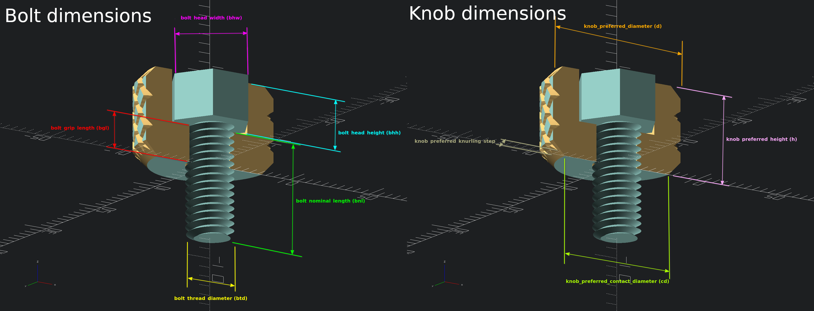

# Knurled knobs generator for bolts and nuts

The file [knurled_knob.scad](knurled_knob.scad) can be used to generate knurled knobs with the help of [OpenSCAD](http://openscad.org/) customizer.

## Usage

The module `knurled_knob()` takes up to 14 parameters:

 1. knob_preferred_height (h)
 2. knob_preferred_diameter (d)
 3. knob_preferred_contact_diameter (cd)
 4. knob_preferred_knurling_step (ks)
 5. bolt_nominal_length (bnl)
 6. bolt_grip_length (bgl)
 7. bolt_head_height (bhh)
 8. bolt_head_width (bhw)
 9. bolt_thread_diameter (btd)
10. knurling_depth (kd)
11. cover (co)
12. printer_tolerance (pt)
13. nozzle_width (nw)
14. layer_height (lh)

A knob builts around bolt dimensions. Additionally you provide the desired dimensions for the knob. The script will accomodate these dimensions as far as possible.
The script will output to the console the final knob dimensions.



## Demo

```sacd
// File knurled_knob_demo.scad
use <knurled_knob.scad>;

// Instantiate a knob with the default parameters
knurled_knob();

// Changing one parameter to the default knob
translate([0, -20, 0])
knurled_knob(co="N"); // set cover to none

// Generete a new knob
translate([0, +30, 0])
knurled_knob(h=24, d=38, cd=24, ks=32, kd=15, bnl=25, bgl=7, bhh=4.2, bhw=10, btd=5.8, co="M");
```


## Using the OpenSCAD customizer

As there are several parameters to generate a knurled knob, it might be more conveninent to use the OpenSCAD customizer to parametrize and to visualize the effects of each parameter.


## Photo


