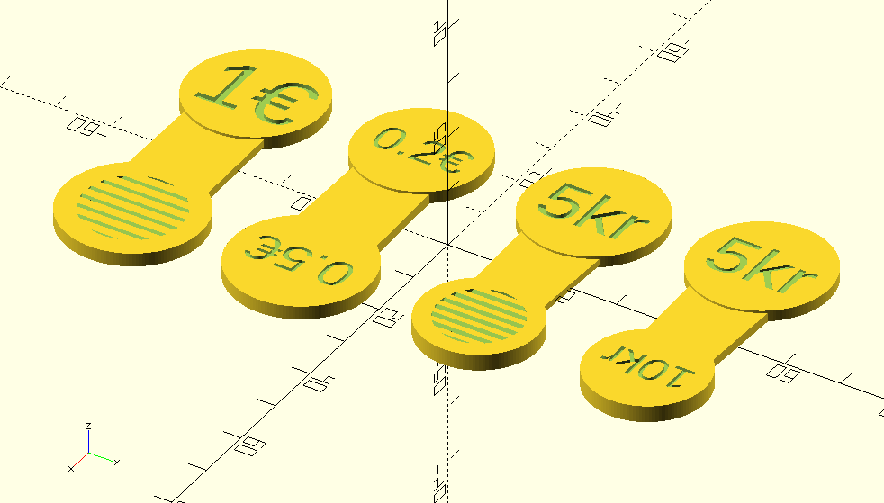

# Parametric trolley token generator

The file `parametric_trolley_token.scad` can be used as an OpenSCAD library to generate trolley tokens of any currency. There are two models to choose from; one with a flat surface convenient to be printed on FDM 3D printers without the need of any support material and another model meant to be printed on a SLA 3D printer.

## Usage:

```
translate([0, 15, 0])
    trolley_token(string1 = "$$", string2 = "€€");
translate([0, 45, 0])
    trolley_token(2.15, 2.35, 23.2, 27.4, "2Fr", "5Fr", true);
translate([0, -15, 0])
    trolley_token(2.14, 2.38, 22.25, 24.25, "0.2€", "0.5€", true);
translate([0, -45, 0])
    trolley_token(2.33, 2.38, 23.25, 24.25, "1€", "0.5€", false);
```

## Rendering:

