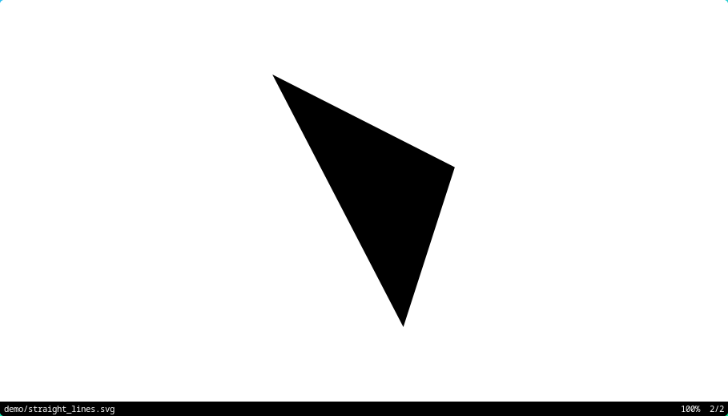
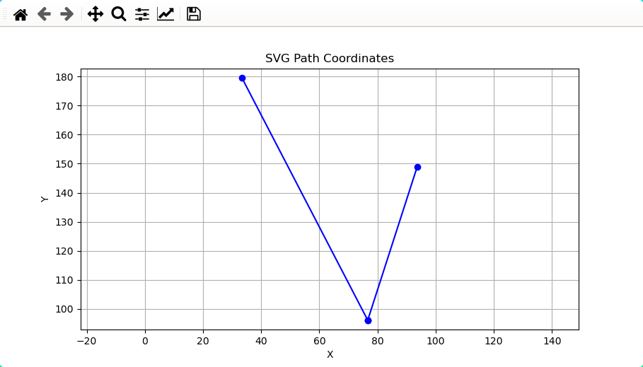
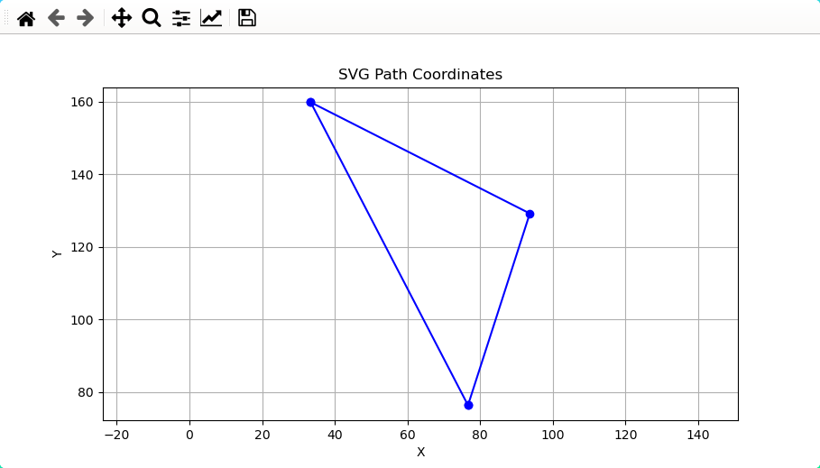
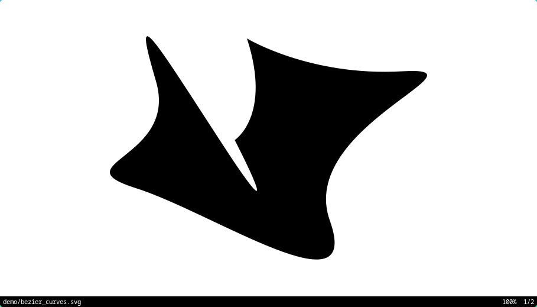
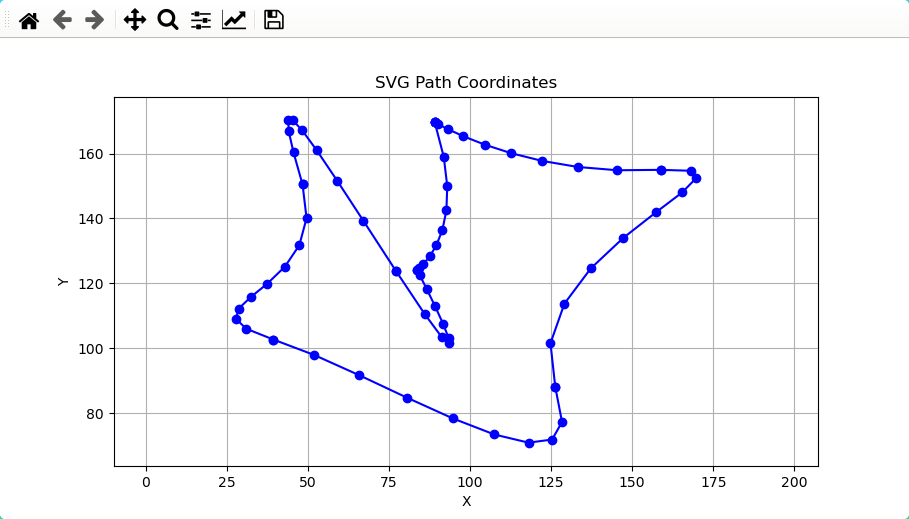
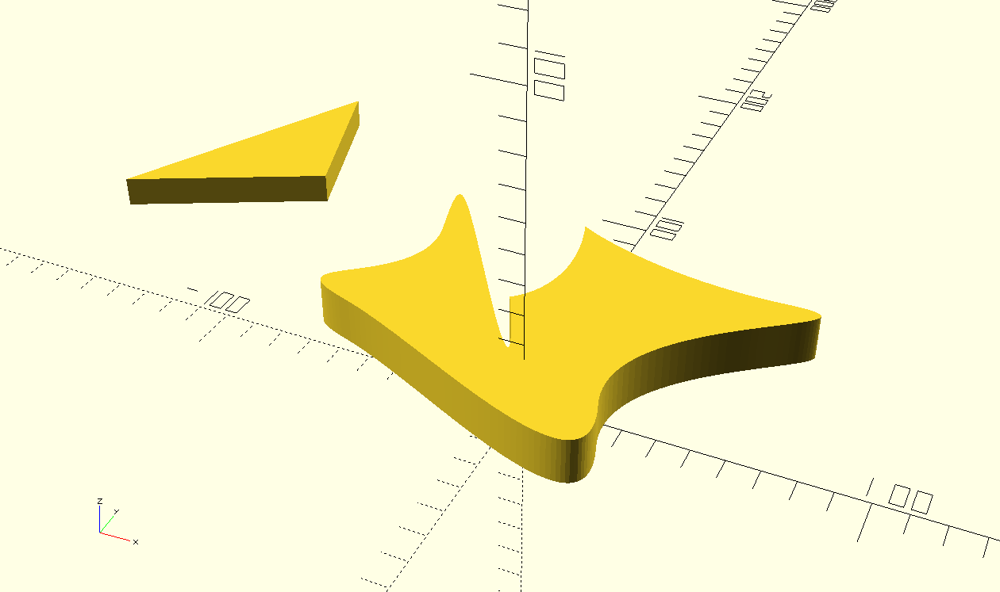

# svg_to_scad.py

## Description

A python script to convert simple SVG files into a list of coordinates.

## Features

- Allows fine-grained control over the number of samples for Bezier curves and arcs

- Capability to output the results into a JSON file or a SCAD file wrapped into a polygon module.

- Flip capbilities

- Scale capilities

- Display graph to visualize the generated result

- Output final result dimensions

## Usage

### Input and output options

``` bash
python svg_to_scad.py --input demo/straight_lines.svg --output demo/straight_lines.json
```

``` results
Width: 60.292721
Height: 83.38827
Coordinates saved to demo/straight_lines.json
```

straight_lines.svg default rendering:



Graph:



### Close option

``` bash
python svg_to_scad.py -i demo/straight_lines.svg -o demo/straight_lines.json --close
```

``` results
Width: 60.292721
Height: 83.38827
Coordinates saved to demo/straight_lines.json
```

Graph:



### Sampling option

``` bash
python svg_to_scad.py -i demo/bezier_curves.svg -o demo/bezier_curves.scad --number-samples 10
```

``` results
Width: 141.81590968696838
Height: 99.41870528120708
Coordinates saved to demo/bezier_curves.scad
```

bezier_curves.svg default redering:



Graph:



### help menu

For a complete list of options, consult the help menu:

``` bash
python svg_to_scad.py --help
```

## Usage example in OpenSCAD

``` openscad
// Load the generated SCAD files
use <straight_lines.scad>
use <bezier_curves.scad>

// Use the polygon modules defined in the included files
translate([-200, -40, 0]) {
    linear_extrude(10)
    straight_lines();
}

translate([-100, -100, 0]) {
    linear_extrude(15)
    bezier_curves();
}
```

Results:


